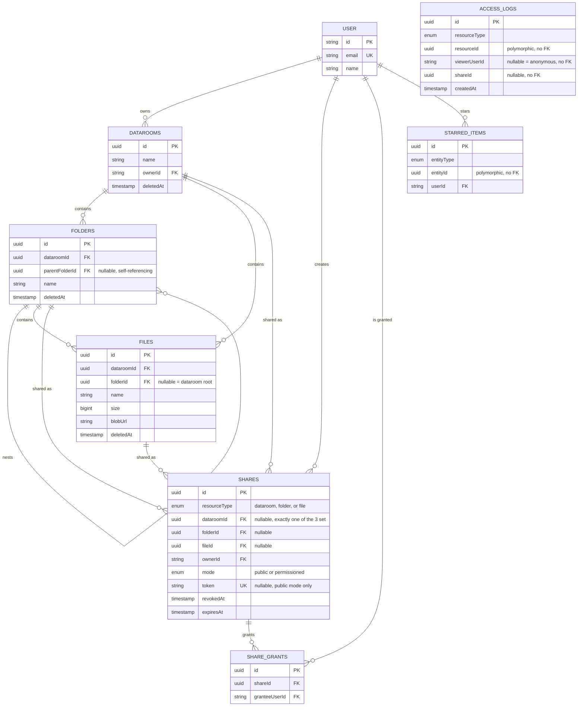

# Data Room

A Google Drive–style Data Room for due diligence: data rooms owned by real user accounts, nested folders, PDF upload/preview/rename/move/delete, bulk select/delete/move, Trash with recursive restore, starring, full-text-free filename search, and sharing — public links (with a branded read-only landing page) and per-user permissioned access, both read-only and revocable, both subtree-inclusive, with an owner-facing activity log tracking who's viewed what through a share.

Built as a take-home evaluation. Full-stack: React SPA + NestJS API + Postgres (Prisma) + Vercel Blob + Better Auth, frontend and backend deployed separately.

## Live demo

- **App**: https://data-room-xi.vercel.app
- **API**: https://data-room-api-7oxb.onrender.com

The backend is on Render's free tier, which spins down after 15 minutes of inactivity — the first request after a while can take up to ~30–60s to wake it back up. Everything after that is normal speed.

## Tech stack

- **Frontend**: React 19, TypeScript, Vite, Tailwind CSS v4, shadcn/ui, react-router, TanStack Query, React Hook Form + Zod
- **Backend**: NestJS, deployed as a persistent Node server (not serverless)
- **Auth**: [Better Auth](https://better-auth.com) — email/password + Google OAuth, session cookies
- **Database**: PostgreSQL via Prisma ORM 7 (with `@prisma/adapter-pg`)
- **File storage**: Vercel Blob (public access, direct browser-to-storage upload)
- **PDF preview**: react-pdf (pdf.js)
- **Hosting**: Vercel (frontend, static), Render (backend), Neon (Postgres)

This mirrors the stack requested in the brief (NestJS + PostgreSQL + Prisma) rather than the Express + Drizzle stack this project started as — see [Project history](#project-history) below.

## Getting started

### Prerequisites

- Node.js ≥ 22.22.1 (see `.nvmrc` — `nvm use` picks it up automatically). This is a hard floor, not a suggestion: `@thallesp/nestjs-better-auth` declares it in `engines` and won't run on anything older.
- A local Postgres server (e.g. [Postgres.app](https://postgresapp.com/) on macOS, or any Postgres install)
- A [Vercel](https://vercel.com) account (for a Blob store — see below)

### 1. Install dependencies

```bash
npm install
```

`postinstall` runs `prisma generate` automatically — this needs `DATABASE_URL` to already be set (step 3), so do that first if `npm install` complains.

### 2. Create a local database

```bash
createdb data_room_v2
```

### 3. Configure environment variables

```bash
cp .env.example .env
```

`.env.example` documents every variable; the ones you actually need to fill in for local dev:

- `DATABASE_URL` — your local Postgres connection string
- `BLOB_READ_WRITE_TOKEN` — see step 4
- `BETTER_AUTH_SECRET` — any random string, e.g. `openssl rand -base64 32`
- `GOOGLE_CLIENT_ID` / `GOOGLE_CLIENT_SECRET` — optional. Leave both blank and the app runs fine with email/password only; Google sign-in is only registered when both are present. To enable it: create an OAuth 2.0 Client ID (Web application) in [Google Cloud Console](https://console.cloud.google.com/apis/credentials), add `http://localhost:5173` to Authorized JavaScript origins and `http://localhost:5173/api/auth/callback/google` to Authorized redirect URIs (the redirect goes through the frontend origin, not the backend — see [Design decisions](#the-oauth-redirect-has-to-go-through-the-frontend-origin-not-the-backend)).

Everything else (`BETTER_AUTH_URL`, `FRONTEND_ORIGIN`, `NEST_PORT`, `VITE_API_URL`) already has the right local-dev default and doesn't need changing.

### 4. Set up a Vercel Blob store

File uploads require a real Vercel Blob store — there's no local/offline substitute.

1. Run `vercel link` in the project root to link this repo to a Vercel project (creates one if you don't have one yet).
2. In the [Vercel dashboard](https://vercel.com/dashboard), go to your project → **Storage** → **Create Database** → **Blob**.
   - **Access mode must be Public.** This app stores each file's blob URL directly in the database and uses it as a plain, unauthenticated URL for preview/download.
3. Connect the store to your project, then go to **Project Settings → Environment Variables** and copy the `BLOB_READ_WRITE_TOKEN` value into `.env`.

### 5. Apply the database schema

```bash
npm run prisma:migrate
```

### 6. Run it

```bash
npm run dev
```

Runs the NestJS backend (port 3001) and the Vite frontend (port 5173) concurrently, with Vite proxying `/api` to the backend so the browser only ever talks to one origin locally — the app is at **http://localhost:5173**.

### Other useful scripts

```bash
npm run typecheck        # tsc across frontend + backend + shared
npm test                 # integration tests against the local Postgres database
npm run build             # frontend production build
npm run build:nest        # backend production build
npm run prisma:studio     # Prisma Studio, a GUI for the local database
```

### Tests

Manual end-to-end QA (including cross-browser: Chrome and Safari specifically, since they turned out to disagree — see [Design decisions](#cookies-safaris-itp-and-why-vercel-proxies-api-to-render)) was the primary verification method throughout — this is a UI-heavy app, and most bugs were interaction/state bugs a unit test wouldn't catch. On top of that, `server/src/test/` has integration tests (real local Postgres, no mocking) for the server-side logic that's easy to get subtly wrong and hard to eyeball-verify:

- **Recursive folder soft-delete/restore** (`dataroom-flows.test.ts`) — cascades `deletedAt` to every descendant, but Trash lists only the root of the deletion; restoring the root restores the whole subtree.
- **Duplicate file name resolution** (`dataroom-flows.test.ts`) — upload auto-suffixes (`Summary.pdf` → `Summary (1).pdf`); rename/move/create hard-reject instead.
- **Sharing access resolution** (`sharing.test.ts`) — ownership, dataroom/folder-level grants reaching nested content but not sibling folders, public tokens (valid/wrong/missing/expired), revocation, and that shared access never extends to mutation.
- **Move, subtree-stats, bulk actions, activity log** (`move-file.test.ts`, `subtree-stats.test.ts`, `bulk-actions.test.ts`, `activity.test.ts`).

## Project structure

```
/server     NestJS backend (controllers → services → Prisma), one module per resource:
              src/auth        — Better Auth config + Nest integration
              src/datarooms, src/folders, src/files, src/trash, src/starred
              src/sharing     — access-resolution algorithm + share CRUD
              src/activity    — owner-facing access-log reads
              src/blob        — Vercel Blob client-token generation
              src/common      — shared exception/filter/pipe plumbing
              src/test        — integration tests (see above)
            prisma/schema.prisma, prisma/migrations/
/frontend   React SPA (Vite root), organized by Feature-Sliced Design:
              src/app        — App shell composition, providers, router
              src/pages      — route-level page compositions
              src/widgets    — page-independent layout blocks (app shell, sidebar)
              src/features   — one slice per resource, each holding its own api/ + model/ + ui/
              src/shared     — shadcn primitives, reusable components, hooks, API client
/shared     Code shared between frontend and backend: TypeScript types + Zod validation schemas
            (single source of truth — the same schema validates a form client-side via zodResolver
            and a request body server-side)
```

## Data model / ERD



Table names above match the real database exactly (`@@map(...)` in `schema.prisma`) — every domain table is plural (`datarooms`, `folders`, ... down to `access_logs`), while `user` (and `session`/`account`/`verification`, not pictured — pure auth plumbing with no domain relationships of their own beyond owning the tables above) stay singular, because those four are generated by Better Auth's own schema generator and use its convention, not this project's. Left as-is rather than force-renamed, since Better Auth would silently revert a manual rename the next time its generator runs.

Two more deliberate departures from a "clean" ERD, both explained more in [Design decisions](#design-decisions):

- **`shares` uses three nullable FKs** (`dataroomId`/`folderId`/`fileId`, exactly one set per row) instead of one polymorphic `(resourceType, resourceId)` pair. Costs a little symmetry, buys a real `onDelete: Cascade` — a share vanishes automatically when its resource is purged, no orphan cleanup job needed.
- **`access_logs` has no enforced FK to anything** (not `user`, not `shares`, not the viewed resource) — deliberately, so a view record survives even after the resource it refers to (or the share that granted access) is later deleted or permanently purged. An owner asking "who looked at this before I revoked it" is exactly the case a cascading FK would silently break.

## How it scales

**How do you compute the total size and item count of a folder including its whole subtree?**

A recursive CTE walks `parent_folder_id` down from the target folder to collect every descendant folder id in one round trip (`getDescendantFolderIds` in `folders.service.ts` — this same query already powers cascading soft-delete and the delete-warning dialog's subtree stats):

```sql
WITH RECURSIVE descendants AS (
  SELECT id FROM folders WHERE id = $1
  UNION ALL
  SELECT f.id FROM folders f JOIN descendants d ON f.parent_folder_id = d.id
)
SELECT id FROM descendants
```

Total size and item count are then two plain aggregates against that id set — `SUM(size)` / `COUNT(*)` on `files WHERE folder_id IN (...)`, `COUNT(*)` on `folders WHERE id IN (...)` — not a second recursive traversal. This is exactly what `GET /folders/:id/subtree-stats` already returns today (folder/file counts, for the delete-warning dialog); a "total size" feature is the same query with one more `SUM` column, not new infrastructure.

**What changes when one Data Room holds 100,000 files (listing, pagination, indexes)?**

- **Listing** currently returns the full result set for a folder (or, in search mode, the whole data room) with no limit. At 100k files that has to become **keyset pagination** (`WHERE (created_at, id) < (:cursor_created_at, :cursor_id) ORDER BY created_at DESC, id DESC LIMIT 50`) — offset pagination (`OFFSET 50000`) degrades linearly with offset depth on Postgres, keyset pagination doesn't.
- **Indexes**: the current indexes (`dataroomId`, `folderId`, `deletedAt` each indexed separately) are enough at today's scale but aren't the composite shape the actual queries need at 100k rows — `getDataroomContents`'s per-folder listing filters on `(folderId, deletedAt)` together, so that needs to be one composite index, not two separate ones Postgres has to intersect. The `AccessLog` table already has its composite index (`resourceType, resourceId, createdAt`) sized for this from the start, anticipating exactly this question.
- **Search** (`ILIKE '%term%'`) can't use a plain btree index at all once it's scanning 100k rows — a leading wildcard defeats a btree. At that scale it needs either a Postgres trigram index (`pg_trgm` + a `GIN` index on `name`) or moving off SQL `LIKE` entirely to a real search service (Postgres full-text search at minimum, Elasticsearch/Meilisearch if search needs to grow further).
- **Dashboard stats** (`getDataroomStats` — storage bytes / folder count / file count per data room, currently a live aggregate query on every dashboard load) stop being cheap to compute on every page view at this scale. The fix is denormalization: either a periodically-refreshed materialized view, or counter columns on `datarooms` updated incrementally on write (upload/delete), traded for eventual consistency on the dashboard numbers.
- **Bulk operations** are already capped (`MAX_BULK_ITEMS = 200` in `shared/validation.ts`) specifically so one request can't be asked to touch an unbounded number of rows regardless of how big the data room gets.

**How does sharing extend to per-user roles (viewer/editor) without remodeling?**

`Share` already has the seam for this, called out directly in `schema.prisma`:

```prisma
// `role` intentionally omitted (viewer-only for v2) — adding `role ShareRole @default(viewer)`
// later is additive, not a remodel.
```

Adding `role ShareRole @default(viewer)` (enum: `viewer`, `editor`) to `Share` is a pure additive migration — no new tables, no changes to `ShareGrant` or the resource FKs. The access-resolution algorithm (`shares-access.service.ts`) already does the hard part: given a resource and a viewer, it resolves whether *any* live `Share` row grants access, walking the ancestor chain so a dataroom/folder-level share covers everything nested inside it. Extending that to permissions is one more check alongside the existing `assertCanView` — an `assertCanEdit` that runs the identical resolution query and additionally requires `role = 'editor'` — reusing the same ancestor-chain logic rather than duplicating it. Every mutation controller would call `assertCanEdit` instead of (today) checking `dataroom.ownerId === session.user.id` directly; read paths and the access log are untouched.

## Design decisions

### Full-stack build, matching the requested stack

The original take-home explicitly allowed a frontend-only mock with no real backend. This one required a real backend, a real database, and real auth, and named NestJS + PostgreSQL + Prisma specifically — so that's what this is, migrated from an earlier Express + Drizzle version built for a related role's take-home (same company). See [Project history](#project-history).

### Auth: Better Auth over hand-rolled sessions

Email/password + Google OAuth via [Better Auth](https://better-auth.com), not a hand-rolled JWT/session implementation. Its NestJS integration (`@thallesp/nestjs-better-auth`) registers a global auth guard with `@AllowAnonymous()`/`@OptionalAuth()` escape hatches, which maps directly onto this app's actual access pattern: owner-only writes, but reads served to the owner, a permissioned grantee, *or* an anonymous public-link visitor — three different "who is this" states one guard has to accommodate per route.

### Sharing: ancestor-chain resolution, not per-row ACLs

Sharing a folder or a whole data room has to implicitly cover everything nested inside it, without writing one `Share` row per descendant file (which would mean re-materializing shares every time a file is added to a shared folder). Instead, `canView(resource, user?, token?)` resolves the resource's ancestor chain up to its data room root, then checks in one query whether any live `Share` matches the resource *or any ancestor in that chain*. A token minted for folder F therefore automatically grants access to a file added to F next week, with no write needed at upload time.

Two access modes share this same resolution path: a **public link** (`mode: "public"`, a high-entropy `crypto.randomBytes(32)` token — deliberately not a UUID, which is lower-entropy and not meant as a bearer credential) and **permissioned per-user grants** (`mode: "permissioned"`, one `Share` fanning out to many `ShareGrant` rows, so revoking one person doesn't touch the others). Both are read-only by construction — every mutation checks `dataroom.ownerId === session.user.id` directly, so there's no "can this grantee edit" branch to accidentally get wrong.

Access is denied with **404, not 403** — the same convention this app already used for ownership checks pre-sharing — so a wrong/expired/revoked token can't be used to confirm a private resource *exists* at all.

### Cookies, Safari's ITP, and why Vercel proxies `/api` to Render

Frontend (Vercel) and backend (Render) are genuinely different origins in production, and Better Auth's session is a cookie. Chrome tolerated this fine with `SameSite=None; Secure`; Safari's Intelligent Tracking Prevention did not — email/password login would return a valid session token in the response body, but the very next request came back unauthenticated, because Safari never stored the `Set-Cookie` from what it treats as a third-party request in the first place. Fighting Safari's cookie policy directly (Storage Access API, etc.) is real complexity for a take-home; making the request genuinely same-origin instead isn't. `vercel.json` proxies `/api/*` straight through to the Render backend, so the browser only ever talks to one origin and the cookie is set exactly like any ordinary same-origin cookie — no `SameSite=None` gymnastics needed at all. This is the same trick local dev already used from day one (Vite's dev-server proxy), just extended to the deployed environment.

### The OAuth redirect has to go through the frontend origin, not the backend

Google's redirect back from its consent screen is a real top-level browser navigation straight to whatever `redirect_uri` was registered — it bypasses the Vercel proxy above entirely, since Google has no idea that proxy exists. Left pointed at the backend's own `onrender.com` domain, this broke two different ways: Chrome's Safe Browsing flagged the shared free-tier Render domain as dangerous and blocked the navigation outright, and Safari couldn't verify the OAuth `state` parameter (set on the frontend's origin when sign-in was initiated, unreadable from a completely different origin during the callback). Better Auth's per-provider `redirectURI` override (not its global `baseURL`) points Google's redirect at the frontend origin instead — which the same Vercel proxy then forwards to the backend like any other request, so initiation and callback share one origin throughout, same fix as the cookie issue above, applied one layer further out.

### Duplicate names: auto-suffix on upload, hard reject on rename/move/create

- **Uploading** a file with a name that collides with a live sibling gets auto-suffixed (`Summary.pdf` → `Summary (1).pdf`), surfaced in the UI. Matches how most consumer file managers handle background uploads, where blocking on every collision would be disruptive.
- **Renaming, moving, or creating** something with a colliding name is rejected inline (409, shown right where the user is looking — the rename field, or the move dialog's still-open folder picker). These are single, deliberate, watched actions, unlike a batch upload — better to let the user immediately pick something else than silently rename it out from under them.

Both are enforced by the same database partial unique index (`folders_unique_name_per_parent` / `files_unique_name_per_parent`, scoped to live rows only via `WHERE deleted_at IS NULL`) — the upload path resolves the name and retries on conflict, the other paths just surface the conflict as a 409.

### Soft-delete, not hard-delete

Deleting a data room, folder, or file sets `deletedAt` rather than removing the row, so it can show up in Trash and be restored.

- Deleting a folder recursively marks its entire subtree, but Trash lists only **roots** of a deletion — an item whose parent is *also* deleted doesn't get its own Trash row, since restoring the parent already brings it back.
- Deleting a data room does **not** cascade to its folders/files — so restoring it doesn't resurrect something that was independently trashed beforehand, on purpose.
- Trash auto-purges anything older than 30 days as a lazy sweep on read, not a scheduled job — no cron infrastructure needed at this scale.
- `AccessLog` rows are never cascade-deleted alongside a purge (see the ERD notes above) — access history is meant to survive the resource it refers to.

### Frontend architecture: Feature-Sliced Design

`app → pages → widgets → features → shared`, with a strict rule that layers only import "downward" — a page can use a feature, a feature never imports a page, and (this mattered concretely once sharing added a genuinely cross-feature dialog) one feature never imports another feature's internals either. `pages/dataroom/model/useEntryActions.ts` and the bulk-action dialogs are where cross-feature composition (folder-actions + file-actions + share-actions together) actually happens, at the page layer, precisely because FSD doesn't allow it lower down.

### Beyond the brief

- **Owner-facing activity log** — every non-owner view (through a share, whether by a logged-in grantee or an anonymous public-link visitor) is recorded in `AccessLog` and surfaced in an activity panel on the data room. An owner's own views are deliberately never logged.
- **Bulk select, delete, and move** — checkbox multi-select across the table/grid view, with best-effort batch endpoints (a per-item 409 is counted and skipped, not a whole-batch failure) rather than N sequential requests from the client.
- **A branded public share landing page** — an anonymous visitor on a public link gets a clean, dedicated read-only layout, not a logged-out shell of the internal app.
- **Security hardening**: rate limiting (`@nestjs/throttler` app-wide, Better Auth's own stricter limits on sign-in/sign-up specifically), high-entropy non-sequential public share tokens (`crypto.randomBytes(32)`, not a UUID), `expiresAt` as a distinct concept from manual revocation, and `helmet()` security headers globally.

### Not implemented

Deliberate scope cuts, given the time budget:

- **Full PDF content search** — filename search only (dataroom-wide, debounced, owner-only — see the "search is owner-only" note in `datarooms.service.ts`, which explains why a shared-folder viewer doesn't get a search box).
- **File versioning on name conflicts** — the brief's other optional extra-credit item; auto-suffix-on-upload was judged higher-value for the time available than keeping multiple versions of the same logical file.
- **Password reset / email verification** — genuinely orthogonal scope for a take-home; `requireEmailVerification: false` throughout.
- **Per-user roles beyond viewer** — see the "How it scales" answer above for exactly how this extends without a remodel; not built because the brief's core requirement is read-only sharing.
- **CI** — considered, cut for time in favor of the additions above.

## A note on AI usage

This project was built in close collaboration with Claude Code throughout — not as autocomplete, but as the primary implementation partner for both the original take-home and this NestJS/Prisma/auth/sharing migration, working from a living plan document (`CLAUDE.md`, checked into this repo) that records the actual design decisions, the reasoning behind them, and what changed once implementation hit reality.

Concretely, that meant:

- **The migration plan itself was designed collaboratively before any code was written** — the full v1 codebase was mapped first, algorithms that had to be preserved exactly (recursive-CTE breadcrumbs and descendant lookups, soft-delete/trash-root semantics, the upload-auto-suffix-vs-rename-hard-reject split) were identified and called out explicitly, and the plan was confirmed before implementation started, rather than redesigning things ad hoc mid-port.
- **I reviewed and redirected the implementation throughout, not just at the end** — examples that changed real code: an early `moveFile` implementation that took four database round trips got collapsed into one; a first pass at the public-link routing had two components independently fetching the same token-resolution data through duplicate route declarations, which I flagged and had merged into one; duplicated `menuItems` logic between two components got extracted once I pointed it out; ESM vs. CommonJS for the backend was my call, overriding the initially-proposed CommonJS setup, once I confirmed Better Auth is ESM-only.
- **Production deployment bugs were root-caused by reproduction, not guesswork** — the Safari cookie issue, a `npm ci` lockfile-determinism failure, and a Vercel Blob token/pathname mismatch were each tracked down by actually reproducing the failure locally (a real clean install matching Render's exact environment; a curl-level replay of the exact browser request that was failing in production) rather than shipping a guessed fix and waiting to see if it worked.
- **Where AI wasn't the right tool**: which stand-out features to build (activity log, bulk actions, security hardening) and every scope-cut decision above were mine, made by weighing the brief's own stated grading priorities against the time available — not something to delegate to a model with no stake in the outcome.

## Project history

This repository started as a take-home for a related role (v1: Express + Drizzle + Postgres + Vercel Blob, no auth, deployed as a single Vercel serverless function). An updated brief explicitly requiring real auth, real sharing, and naming NestJS + PostgreSQL + Prisma as their stack — this is that migration, not a separate project. `CLAUDE.md` has the full plan and a phase-by-phase implementation log if you want the detailed history of what changed and why.
